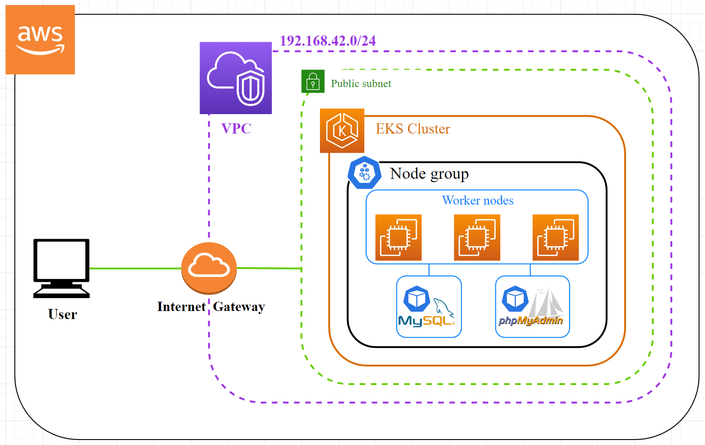

## Infrastructure plan




## Prerequisites

Install [awscli](https://docs.aws.amazon.com/cli/latest/userguide/getting-started-install.html) & [Terraform](https://learn.hashicorp.com/tutorials/terraform/install-cli)


Create main.tfvars files,

for *eks-cluster-provisioning*:
```
cat <<EOF | sudo tee ./eks-cluster-provisioning/main.tfvars
my_ip = "<public_ip>/32"
EOF
```
Replace *<public_ip>* with your own public IP, so only you can have access.

for *kubernetes-objects-provisioning*:
```
cat <<EOF | sudo tee ./kubernetes-objects-provisioning/main.tfvars
mysql_root_password = "<root_password>"
EOF
```
Replace *<root_password>* with a secure password.

## Commands

Configure AWS access to connect to AWS API:

`aws configure`

Provision EKS Cluster:
```
terraform -chdir="./eks-cluster-provisioning" init

terraform -chdir="./eks-cluster-provisioning" plan -var-file="main.tfvars"

terraform -chdir="./eks-cluster-provisioning" apply -var-file="main.tfvars"
```

Add kubeconfig in local machine to access EKS cluster:

`aws eks update-kubeconfig --name iac-eks-cluster`

Provision Kubernetes objects (MySQL & phpMyAdmin deployments and services):
```
terraform -chdir="./kubernetes-objects-provisioning" init

terraform -chdir="./kubernetes-objects-provisioning" plan -var-file="main.tfvars"

terraform -chdir="./kubernetes-objects-provisioning" apply -var-file="main.tfvars"
```

## Verification

Access to phpMyAdmin from Classic Load Balancer DNS name:

`curl $(aws elb describe-load-balancers --output text --query 'LoadBalancerDescriptions[*].DNSName[]')`

OR

Copy the output from this command:

`aws elb describe-load-balancers --output text --query 'LoadBalancerDescriptions[*].DNSName[]'`

And paste it to your web browser.

## Once finished

Destroy provisioned resources:
```
terraform -chdir="./kubernetes-objects-provisioning" destroy -var-file="main.tfvars"

terraform -chdir="./eks-cluster-provisioning" destroy -var-file="main.tfvars"
```
