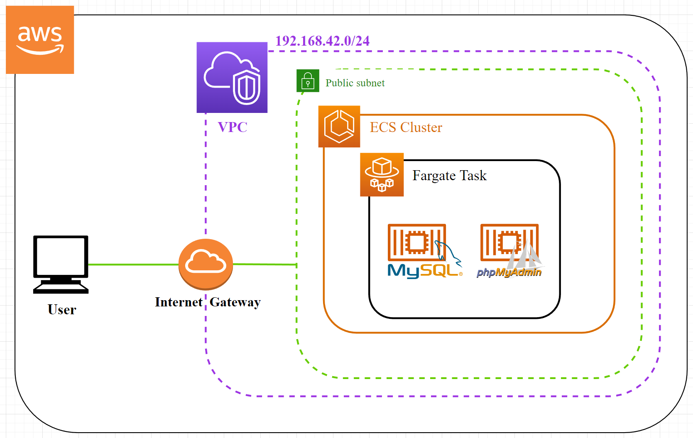

## Infrastructure plan




## Prerequisites

Install [awscli](https://docs.aws.amazon.com/cli/latest/userguide/getting-started-install.html) & [Terraform](https://learn.hashicorp.com/tutorials/terraform/install-cli)


Create main.tfvars file:
```
cat <<EOF | sudo tee ./main.tfvars
my_ip               = "<public_ip>/32"
mysql_root_password = "<root_password>"
EOF
```
Replace *<public_ip>* with your own public IP, so only you can have access.

Replace *<root_password>* with a secure password.

## Commands

Configure AWS access to connect to AWS API:

`aws configure`

Provision ECS Cluster, Task definitions and containers:
```
terraform init

terraform plan -var-file="main.tfvars"

terraform apply -var-file="main.tfvars"
```

## Verification

Access to phpMyAdmin from Fargate instance Public DNS name:
```
TASK_ARN=$(aws ecs list-tasks --output text --cluster iac-cluster --query 'taskArns[]')

ENI_ID=$(aws ecs describe-tasks --output text --cluster iac-cluster --task $TASK_ARN --query 'tasks[*].attachments[*].details[1].value[]')

DNS_NAME=$(aws ec2 describe-network-interfaces --output text --network-interface-ids $ENI_ID --query 'NetworkInterfaces[*].Association[].PublicDnsName[]')
```

Then:

`curl $DNS_NAME`

OR

Copy the output from this command:

`echo $DNS_NAME`

And paste it to your web browser.

## Once finished

Destroy provisioned resources:
```
terraform destroy -var-file="main.tfvars"
```
