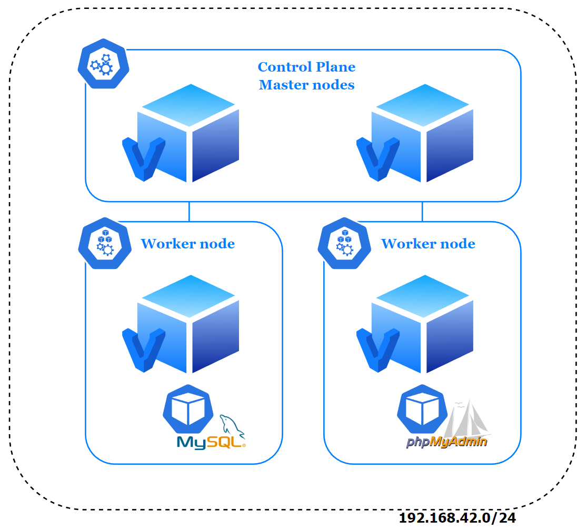

## Before starting

> Kubernetes is fully deployed in IaC following "Kubernetes The Hard Way" method. More details: https://github.com/ydamni/kubernetes-the-iac-way

## Infrastructure plan




## Prerequisites

### Hardware requirements

RAM: 8 GB minimum | 16 GB recommended

Disk space: 50 GB

### Software requirements

Install [Vagrant](https://www.vagrantup.com/downloads) & [Ansible](https://docs.ansible.com/ansible/latest/installation_guide/intro_installation.html)


## Commands

Provision Vagrant nodes and execute Ansible playbook:
```
vagrant up
```

## Verification

### From master node

Connect to one of your **master** node:

`vagrant ssh master-1`

Access to phpMyAdmin from any worker on port 30080:

`curl worker-1:30080`


## Once finished

Destroy provisioned resources:
```
vagrant destroy
```
